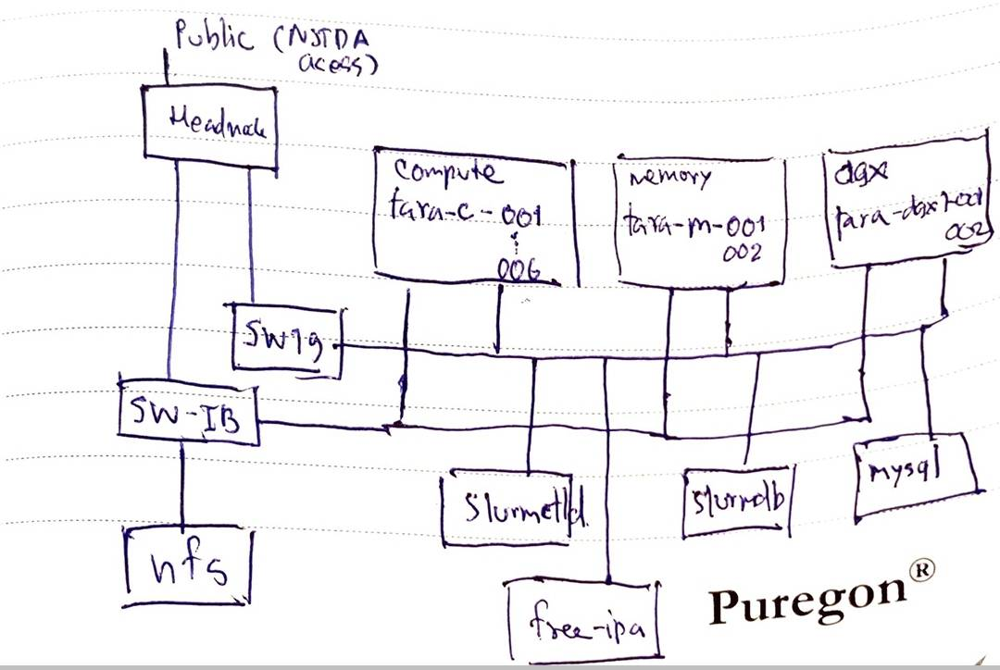

=================================
Installation Plan (Test System)
=================================

SLURM installation plan for Tara cluster. 

Timeline
==================

Wednesday meeting: Set weekly goals and progress update? 

.. tabularcolumns:: |l|p{14cm}|

================  ============================== 
Important Date    Plan            
================  ============================== 
16 Oct 2018       Initial meeting. 
24 Oct 2018       **Implementation**: Prepare the machines to the :ref:`prerequisites` state and **document** for initializing the machines. 
                     
                  **Testing**: Prepare the plan and, if possible, automate script to test initail services in :ref:`prerequisites`.
31 Oct 2018       **Implementation**: Implementation document for SLURM
                     
                  **Testing**: Plan and testing script for SLURM. 
16 Nov 2018       **Implementation**: 

                  * New VM environment 
                  * SLURM plugins: 

                    * PAM 
                    * cgroup 
                    * nhc  
                    * PMIx

                  * SLURM preemption
                  * Setting up separate DNS using BIND
                  * Setting up lmod/EasyBuild
                
                    * ``foss``
                    * ``mpi-foss``
                    * ``lampps``

                  * freeipa-server + free-client. 
                    
                  **Config**:

                  * ``gres.conf``
                  * ``topology.conf``
                  * Code repository for SLURM config.

                  **Testing**: 

                  * SLURM basic function
                  * VM Topology
                  * freeipa + dns separation 
                  * Installation document

21 Nov 2018       **Implementation**: 
                     
                  **Testing**:                      
28 Nov 2018       **Implementation**: 
                     
                  **Testing**:                      
================  ============================== 

Teams
===========

================  =========
Implementation    Testing 
================  =========
P Ar+, Arm        Best, Oat, Eee
================  =========

General Information
=====================

| **SLURM Version**: 18.08.1 (Oct 8, 2018)
| **MUNGE Version**: 0.5.13 (Sep 27, 2017)

| **SLURM user**: ``slurm``
| **SLURM user environment variable**: ``SLURMUSER``
| **SLURM UID**: ``982``
| **SLURM group**: ``slurm``
| **SLURM GID**: ``982``

| **MUNGE user**: ``munge``
| **MUNGE user environment variable**: ``MUNGEUSER``
| **MUNGE UID**: ``981``
| **MUNGE group**: ``munge``
| **MUNGE GID**: ``981``

.. _prerequisites:

Prerequisites
=====================

* A set of virtual machines with following components installed 

    * *Clean* installation of CentOS 7. (If possible, the initial state of Tara cluster machines.)
    * ``freeIPA``.
    * ``NTP`` (Should be installed as a part of ``freeIPA``)
    * An NFS storage mounted to all machines. (Can we create a virtual HDD and mount it to all machine?)
    * Name resolution mechanism either through DNS or ``/etc/hosts`` files. 

* A Unix user **munge** for use by ``munge`` on all nodes of the cluster. 

* A Unix user **slurm** for use by ``slurmctld`` on all nodes of the cluster. 

Adding users
===============

* Add user in ``freeipa``
* Add user in SLURM through ``sacctmgr``. command ? 

Machine Configuration
======================

============  ====================  ================  ===============  ======
Node Class    NodeName              IP (InfiniBand)   IP (1GbE)        Notes
============  ====================  ================  ===============  ======
freeipa       freeipa                                 172.21.5.2       VM
slurmctld     slurmctld                               172.21.5.3       VM
slurmdbd      slurmdbd                                172.21.5.4       VM
mysql         mysql                                   172.21.5.5       VM
frontend      tara-frontend-1       172.20.1.2        172.21.1.2
compute       tara-c-[001-006]      172.20.10.1 -     172.21.10.1 -
                                    172.20.10.6       172.21.10.6
memory        tara-m-[001-002]      172.20.20.1 -     172.21.20.1 -    FAT nodes
                                    172.20.20.2       172.21.20.2
dgx           tara-dgx1-[001-002]   172.20.31.1 -     172.21.31.1 -    dgx1 is reserved. 
                                    172.20.31.2       172.21.31.2
============  ====================  ================  ===============  ======

Machine Layout
----------------

.. _slurm-services:

SLURM Services
=====================

SLURM package to be installed 

.. tabularcolumns:: |l|l|

================  ==========
Node Class        Services
================  ==========
Controller (VM)   ``slurm``, ``slurm-perlapi``, ``slurm-slurmctld``
Compute           ``slurm``, ``slurm-perlapi``, ``slurm-slurmd``
Frontend          ``slurm``, ``slurm-perlapi``
SlurmDBD (VM)     ``slurm``, ``slurm-dbd``
================  ==========

.. _slurm-plugins:

Plugins Dependencies 
======================

| List of plugins and their dependencies to be installed when building SLURM RPM packages. 
| *Need to check that the package contains these plugins after installing*

.. tabularcolumns:: |l|l|

============================  =====================
Plugins                       Dependencies        
============================  =====================
**MUNGE**                     ``munge-devel``     
**PAM Support**               ``pam-devel``       
**cgroup Task Affinity**      ``hwloc-devel``     
**IPMI Engergy Consumption**  ``freeimpi-devel``  
**Lua Support**               ``lua-devel``       
**My SQL Support**            ``mysql-devel``     
============================  =====================

* [TBD]
    * **InfiniBand Accounting**: ``libibmad-devel``, ``libibumad-devel`` 
    * **cgroup NUMA Affinity**: ???                 

Configuration
==================

Configuration in ``/etc/slurm.conf``

.. tabularcolumns:: |l|l|p{6cm}|

=========================  ====================================  ==========
Config                     Value                                 Detail
=========================  ====================================  ========== 
**SlurmctldHost**          *slurmctld*                           Might need to set as *slurmctld slurmctld.hpc.nstda.or.th*
**AuthType**               *auth/munge*
**CryptoType**             *crypto/munge* 
**GresTypes**              *gpu*

**JobRequeue**             *1*                                   Automatically requeue batch jobs after node fail or preemption.
**LaunchType**             *launch/slurm*

**MailProg**               ``/bin/mail``

**MpiDefault**             *pmix*

**PrivateData**            *jobs,usage,users*                    Prevents users from viewing, jobs, usage of any other user, and information of any user other than themselves.
**ProctrackType**          *proctrack/cgroup*

**SlurmctldPidFile**       ``/var/run/slurm/slurmctld.pid``      Local file
**SlurmctldPort**          *6817*                         
**SlurmdPidFile**          ``/var/run/slurm/slurmd.pid``         Local file
**SlurmdPort**             *6818*
**SlurmdSpoolDir**         ``/var/spool/slurm/slurmd``           Should be local file system
**SlurmUser**              *slurm*
**SlurmdUser**             *root*
**StateSaveLocation**      ``/var/spool/slurm/slurm.state``      Should be local file system

**SwitchType**             *switch/none*

**TaskPlugin**             *task/affinity*
**TaskPluginParam**        *Sched*

**TopologyPlugin**         *topology/tree*                                
**RoutePlugin**            *route/topology*                      **[TBD]**
**TmpFS**                  ``/tmp``                              A node's TmpDisk space
    
**CpuFreqGovernors**       *OnDemand, Performance,*              See. :ref:`cpu-governers`
                           *PowerSave, UserSpace*  
**CpuFreqDef**             *Performance*                         Default: Run the CPU at the maximum frequency.
=========================  ====================================  ==========

* **SlurmctldPort** can use a range of port. Should we use 1 port per frontend? 

.. note::

    The topology.conf file for an Infiniband switch can be automatically generated using 
    the slurmibtopology tool found here: `<https://ftp.fysik.dtu.dk/Slurm/slurmibtopology.sh>`_

Job Scheduling 
----------------

.. tabularcolumns:: |l|l|p{6cm}|

=========================  =============================  ==========
Config                     Value                          Detail
=========================  =============================  ==========
**FastSchedule**           *1*
**SchedulerType**          *sched/backfill* 
**SchedulerParameters**    
**SelectType**             *select/cons_res*              See. `Consumable Resources in Slurm <https://slurm.schedmd.com/cons_res.html>`_ 
**SelectTypeParameters**   *CR_Socket_Memory*             Sockets and memory are consumable resources.

**KillWait**               *30*                           The interval given to a job's processes between the SIGTERM and SIGKILL signals upon reaching its time limit.
**OverTimeLimit**          *5*                            Number of *minutes* by which a job can exceed its time limit before being canceled.
**PreemptMode**            *REQUEUE*                      Preempts jobs by requeuing them (if possible) or canceling them.
**PreemptType**            *preempt/qos*                  Job preemption rules are specified by Quality Of Service (QOS).
=========================  =============================  ==========

Job Priority
----------------

.. tabularcolumns:: |l|l|p{6cm}|

=============================  =============================  ==========
Config                         Value                          Detail
=============================  =============================  ==========
**PriorityType**               *priority/multifactor*         See. `Multifactor plugin <https://slurm.schedmd.com/priority_multifactor.html>`_
**PriorityDecayHalfLife**      *7-0*                          The impact of historical usage (for fare share) is decayed every 7 days. 
**PriorityCalcPeriod**         *5*                            Halflife decay wii be re-calculated every 5 minutes
**PriorityFavorSmall**         *NO*                           Larger job will have higher priority. Allocating whole machine will result in the 1.0 job size factor.
**PriorityFlags**              TBD     
**PriorityMaxAge**             *7-0*                          Job will get maximum age factor (1.0) when it reside in the queue for more than 7 days. 
**PriorityUsageResetPeriod**   *NONE*                         Never clear historic usage
**PriorityWeightAge**          *1000*
**PriorityWeightFairshare**    *10000*
**PriorityWeightJobSize**      *1000*
**PriorityWeightPartition**    *1000*
**PriorityWeightQOS**          *1000*
**PriorityWeightTRES**
=============================  =============================  ==========

* If **PriorityFavorSmall** is set to *YES*, the single node job will receive the 1.0 job size factor
* **[TBD]** Some interesting values for **PriorityFlags**

    * *ACCRUE_ALWAYS*: Priority age factor will be increased despite job dependencies or holds. 
    
        This could be beneficial for BioBank job where jobs have dependencies, so the dependent 
        jobs could run as soon as the prior job is finished due to high age factor. 
        However, users could abuse this system by adding a lot of job and hold them to increase age factor. 

    * *SMALL_RELATIVE_TO_TIME*: The job's size component will be based upon the the job size divided by the time limit.

        In layman's terms, a job with *large allocation and short walltime* will be more preferrable. 
        This could promote a better user behavior, since users who have better estimation of their 
        need will get a better priority and will eventually encourage users to parallelize their programs. 
        However, serial programs, e.g. MATLAB if limited by the license, with a long running time will face 
        a problem when trying to run on the system. Such problem could be solved by having a specialized  
        partition, with high enough priority to compensate for the job size, for serial jobs. 

Health Check
-------------

.. tabularcolumns:: |l|l|p{6cm}|

=========================  =============================  ==========
Config                     Value                          Detail
=========================  =============================  ==========
**HealthCheckProgram**     ``/usr/sbin/nhc``              ``nhc`` can be installed from `<https://github.com/mej/nhc>`_. For more information See. `[1] <https://wiki.fysik.dtu.dk/niflheim/Slurm_configuration#node-health-check>`_ and `[2] <https://slurm.schedmd.com/SUG14/node_health_check.pdf>`_
**HealthCheckInterval**    *3600*                   
**HealthCheckNodeState**   *ANY*                          Run on nodes in any state. 
=========================  =============================  ==========

| Should we set **HealthCheckNodeState** to *IDLE* to avoid performance impact?
| Other possible values: *ALLOC*, *MIXED*

Logging and Accounting
-------------------------

.. tabularcolumns:: |l|l|p{6cm}|

=============================  ===================================  ==========
Config                         Value                                Detail
=============================  ===================================  ==========
**AccountingStorageType**      *accounting_storage/slurmdbd*
**AccountingStoreJobComment**  *YES*

**ClusterName**                *tara*

**JobCompType**                *jobcomp/slurmdbd*
**JobAcctGatherFrequency**     *30*
**JobAcctGatherType**          *jobacct_gather/linux*

**SlurmctldLogFile**           ``/var/log/slurm/slurmctld.log``
**SlurmdLogFile**              ``/var/log/slurm/slurmd.log``
**SlurmSchedLogFile**          ``/var/log/slurm/slurmsched.log``
**SlurmSchedLogLevel**         *1*                                  Enable scheduler logging

**AccountingStorageTRES**                                           **[TBD]** Default: Billing, CPU, Energy, Memory, Node, and FS/Disk. 
                                                                    Possible addition: GRES and license.
**AcctGatherEnergyType**       *acct_gather_energy/ipmi*            **[TBD]** For energy consumption accounting. Only in case of exclusive job allocation the energy consumption measurements will reflect the jobs real consumption
=============================  ===================================  ==========

Prolog and Epilog Scripts
--------------------------

=========================  =============================  ==========
Config                     Value                          Detail
=========================  =============================  ==========
**Prolog**             
**Epilog**    
**PrologSlurmctld**                                       Executed once on the ControlMachine for each job   
**EpilogSlurmctld**                                       Executed once on the ControlMachine for each job
=========================  =============================  ==========

``slurm.conf``
---------------

.. code:: bash

    ClusterName=tara

Node Configuration (Testing System)
===================================

.. tabularcolumns:: |l|l|l|l|

============  ====================  ================================  
Node Class    NodeName              Notes
============  ====================  ================================  
freeipa       \-                    
slurmctld     slurmctld             
slurmdbd      slurmdbd              
mysql         \-                    
frontend      \-                    
compute       tara-c-[001-006]      
memory        tara-m-[001-002]      FAT nodes
dgx           tara-dgx1-[001-002]   dgx1 is reserved. 
============  ====================  ================================  

.. warning:: Changes in node configuration (e.g. adding nodes, changing their processor count, etc.) require restarting both the ``slurmctld`` daemon and the ``slurmd`` daemons.

| **NodeName**: The name used by all Slurm tools when referring to the node
| **NodeAddr**: The name or IP address Slurm uses to communicate with the node
| **NodeHostname**: The name returned by the command ``/bin/hostname -s``
|
| **TmpDisk**: Total size of temporary disk storage in **TmpFS** in megabytes (e.g. "16384"). *TmpFS* (for "Temporary File System") identifies the location which jobs should use for temporary storage. Note this does not indicate the amount of free space available to the user on the node, only the total file system size. *The system administration should ensure this file system is purged as needed so that user jobs have access to most of this space.* The Prolog and/or Epilog programs (specified in the configuration file) might be used to ensure the file system is kept clean. 

``slurm.conf``
---------------

.. code:: bash

    # COMPUTE NODES
    NodeName=tara-c-[001-006] CPUs=4 RealMemory=512 Sockets=2 CoresPerSocket=2 ThreadsPerCore=1 State=UNKNOWN TmpDisk=256
    NodeName=tara-m-[001-002] CPUs=8 RealMemory=1024 Sockets=2 CoresPerSocket=4 ThreadsPerCore=1 State=UNKNOWN TmpDisk=512
    NodeName=tara-dgx1-[001-002] CPUs=4 RealMemory=1024 Sockets=2 CoresPerSocket=2 ThreadsPerCore=1 Gres=gpu:volta:8 State=UNKNOWN TmpDisk=512

Partitions (Testing System)
===========================

.. tabularcolumns:: |l|l|r|l|p{6cm}|

===============  =================  ==========  =====  ===========
Partition        AllocNodes         MaxTime     State  Additional Parameters
===============  =================  ==========  =====  ===========
debug (default)  tara-c-[001-002]    02:00:00   UP     DefaultTime=00:30:00
standby          tara-c-[001-006]   120:00:00   UP
memory           tara-m-[001-002]   120:00:00   UP
dgx              tara-dgx1-002      120:00:00   UP     OverSubscribe=EXCLUSIVE
biobank          tara-dgx1-001      UNLIMITED   UP     AllowGroups=biobank 
                                                       OverSubscribe=EXCLUSIVE
===============  =================  ==========  =====  ===========

| **AllowAccounts**: Comma separated list of accounts which may execute jobs in the partition. The default value is "ALL" 
| **AllowGroups**: Comma separated list of group names which may execute jobs in the partition. If at least one group associated with the user attempting to execute the job is in AllowGroups, he will be permitted to use this partition. Jobs executed as user root can use any partition without regard to the value of AllowGroups.
| **AllowQos**: Comma separated list of Qos which may execute jobs in the partition. Jobs executed as user root can use any partition without regard to the value of AllowQos.
| **OverSubscribe**: Controls the ability of the partition to execute more than one job at a time on each resource. Jobs that run in partitions with ``OverSubscribe=EXCLUSIVE`` will have exclusive access to all allocated nodes.

``slurm.conf``
---------------

.. code:: bash

    # PARTITIONS
    PartitionName=debug Nodes=tara-c-[001-002] Default=YES MaxTime=02:00:00 DefaultTime=00:30:00 State=UP
    PartitionName=standby Nodes=tara-c-[001-006] MaxTime=120:00:00 State=UP
    PartitionName=memory Nodes=tara-m-[001-002] MaxTime=120:00:00 State=UP
    PartitionName=dgx Nodes=tara-dgx1-002 MaxTime=120:00:00 State=UP OverSubscribe=EXCLUSIVE
    PartitionName=biobank Nodes=tara-dgx1-001 MaxTime=120:00:00 State=UP AllowGroups=biobank OverSubscribe=EXCLUSIVE

MPI
-----

We will support only MPI libraries and versions that support ``PMIx`` APIs as follow

* OpenMPI
* MPICH (version 3) (Do we need MPICH2 ?)
* IntelMPI

Notes
===================

.. _cpu-governers:

CPU Frequency Governer 
------------------------

From `<https://wiki.archlinux.org/index.php/CPU_frequency_scaling#Scaling_governors>`_  

=========================  ==============
Governor                   Description
=========================  ==============
Performance                Run the CPU at the maximum frequency.
PowerSave                  Run the CPU at the minimum frequency.
OnDemand                   Scales the frequency dynamically according to current load. Jumps to the highest frequency and then possibly back off as the idle time increases.
UserSpace                  Run the CPU at user specified frequencies.
Conservative (not used)    Scales the frequency dynamically according to current load. Scales the frequency more gradually than ondemand.
=========================  ==============

TODO
===================

* Install and config MUNGE on all nodes
* Build SLURM RPMs and install on each node as shown in :ref:`slurm-services`. To enable required plugins see. :ref:`slurm-plugins` for the list of additional libraries. 

    * Set ``SlurmUser`` in the ``slurm.conf`` configuration file.     
    * Files and directories used by ``slurmctld`` will need to be readable or writable by the user SlurmUser (the Slurm configuration files must be readable; the log file directory and state save directory must be writable).
    * The parent directories for Slurm's log files, process ID files, state save directories, etc. **are not created by Slurm**. They must be created and made writable by SlurmUser as needed prior to starting Slurm daemons.

* Configure SLURM PAM module to limit access to allocated compute nodes. 

    * On job termination, any processes initiated by the user outside of Slurm's control may be killed using an ``Epilog`` script configured in ``slurm.conf``.
